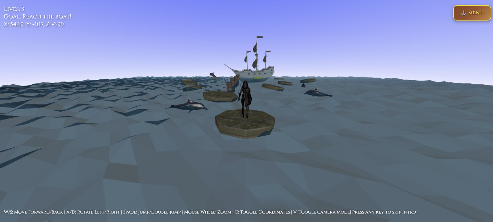

# 🏴‍☠️ Castaway Pirate - Interactive 3D Adventure Game

An immersive 3D platformer adventure game built with Three.js, where you play as a pirate Captain  navigating treacherous waters to reach your pirate ship.

 

## 🎮 Game Overview

**Castaway Pirate** is a challenging 3D platformer where players must guide a stranded pirate across floating rocks, sinking logs, and dangerous waters while avoiding animated obstacles. The goal is to reach the golden boarding rock and climb aboard your ship to escape.

### 🎯 Objective
Navigate from the beach to your pirate ship by jumping across floating platforms while avoiding:
- 🦀 Scuttling crabs on platforms
- 🐬 Jumping dolphins in the water
- ⏰ Sinking logs that disappear after standing on them
- 🌊 Deadly water that causes drowning

## ✨ Key Features

### 🏃‍♂️ Advanced Character Animation System
- **Complex bone-based animations** with 70+ bone structure
- **5 different animation states**: Idle, Walk, Sprint, Jump, Drown
- **Smooth animation transitions** with interpolation
- **Realistic drowning sequence** with struggle animations
- **Sprint system** activated by double-tapping W

### 🌍 Dynamic 3D Environment
- **Procedural wave animations** with multiple sine wave layers
- **Living forest** with 80+ trees (Pine, Oak, Birch) with swaying animations
- **Floating platforms** with individual bobbing physics
- **Sinking log mechanics** with bubble effects
- **Dynamic lighting** with shadows and realistic sun positioning
- **Gradient sky system** with shader-based rendering

### 🎮 Sophisticated Gameplay Mechanics
- **Dual control modes**: Player rotation vs Camera rotation (V to toggle)
- **Double jump system** for advanced platforming
- **Collision detection** for platforms, obstacles, and solid objects
- **Proximity-based obstacle interactions**
- **Timed boarding sequence** for ship victory condition
- **Lives system** with respawning

### 🦀 Intelligent AI Obstacles
- **Animated crabs** with scuttling patterns and directional changes
- **Dolphins** with figure-8 swimming patterns and jumping behaviors
- **Dynamic obstacle positioning** with collision avoidance

### 🎨 Visual Excellence
- **PBR materials** with normal maps and roughness textures
- **Real-time shadows** with configurable quality
- **Particle effects** for sinking logs (bubbles)
- **Texture-based materials** for all surfaces
- **Atmospheric fog** for depth perception

## 🎮 Controls

| Key | Action |
|-----|--------|
| **W** | Move Forward |
| **W + W** (double-tap) | Sprint |
| **S** | Move Backward |
| **A** | Rotate Left (or Camera Left in camera mode) |
| **D** | Rotate Right (or Camera Right in camera mode) |
| **Space** | Jump (Double jump available) |
| **V** | Toggle Camera/Player control mode |
| **C** | Toggle coordinate display |

## 🏗️ Technical Architecture

### Core Systems
- **GameLogic.js**: Main game state management and physics
- **Player3.js**: Advanced character animation and bone manipulation
- **Environment.js**: World generation and platform management
- **CameraManager.js**: Dynamic camera system with intro sequences
- **InputHandler.js**: Input processing with sprint detection

### Rendering Pipeline
- **Three.js WebGL Renderer** with shadow mapping
- **Custom shader materials** for sky gradients
- **Texture loading system** with fallback materials
- **Real-time lighting** with directional and ambient lights

### Asset Management
- **FBX model loading** for complex animated characters
- **OBJ model loading** for static objects
- **MTL material loading** with texture mapping
- **Texture caching** and error handling

## 🎯 Game Flow

1. **Beach Start**: Begin on the forest
2. **Platform Hopping**: Jump across floating rocks in sequence
3. **Sinking Logs**: Quick navigation across temporary platforms
4. **Obstacle Avoidance**: Dodge crabs and dolphins
5. **Golden Rock**: Reach the yellow boarding platform
6. **Ship Boarding**: Board for 3 seconds to win

## 🛠️ Installation & Setup

```bash
# Clone the repository
git clone [repo-url]

# Navigate to project directory
cd castaway_pirate

# Serve locally (Python)
python -m http.server 8000

# Or use Live Server in VS Code
# Right-click [index.html](http://_vscodecontentref_/0) → "Open with Live Server"
